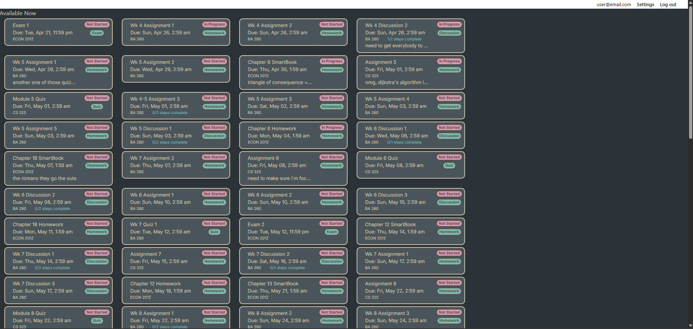
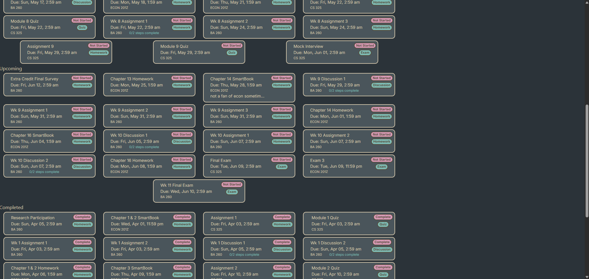

# Kestrel Assignment Tracker

A student planning and prioritization tool currently under development and built with Elixir, Phoenix LiveView, PostgreSQL, and Tailwind.

Kestrel is an assignment tracker built around the concept that the unlock date is actually more important than the due date. It takes all of a student's assignment data and it does 2 things. It de-emphasizes what can't be worked on yet, and it allows for custom prioritization of currently available assignments based on some limited information about them. It is not a calendar, it is not a scheduler, it is not a progress tracker, it is not a GPA calculator. It shows you what you have on your plate, relevant information about those things, and lets you decide what's important so you can go do it.

## Current Status

Kestrel is currently in early development.

Implemented:
- Relational PostgreSQL schema designed around an assignment-focused user
- Custom login redirect for unconfirmed users
- Primary assignment list structuring and default prioritization
- Validation testing for seed data relational integrity
- Assignment rendering in browser based on assignment status
- Client-side time zone detection and data transformation
- Initial assignment "min" cards for dashboard

In Progress:
- Implement Tailwind styling
- Assignment steps expand/collapse functionality
- Priority-based layout and min card adjustments

A live MVP/prototype/proof-of-concept called Sage is available at sage-at.com. There is no test data available, so you must register for an account and enter your own data. I have been using this live prototype for my actual live assignment tracking for several months and I'm very happy that I'm not using a Python script like I was before.

## Screenshots

As of 2026-05-16

Auto-generated Phoenix LiveView header visible above test data showing assignments that can be worked on.

Separation of assignments that can be worked on (at the top of the image), assignments waiting to unlock, and assignments that have been completed.

## Tech Stack

- Elixir
- Phoenix LiveView
- PostgreSQL
- Tailwind CSS

## Architecture Design Notes

I chose Elixir primarily because I wanted to learn it. I actually chose Elixir for a project before I chose the assignment tracker to be that project. It just happened to line up that Elixir and the Phoenix LiveView framework are perfect for a real-time interactive tool like Kestrel. The concurrency was really interesting to me. Being able to run millions of different Actors (processes) concurrently on the Erlang VM (BEAM) seemed more coherent to me than Javascript's usage of async and await to simulate concurrency in a linear process.

The Phoenix LiveView framework went along with choosing Elixir, and immediately impressed me with its stateful connection to the browser via WebSockets rather than API endpoints. Connection, rendering, and event handling made more sense out of the box. The only thing that made me hesitate is the server-side nature of LiveView's DOM diffing, but due to the nature of the minimal amount of data actually being transmitted at any given time, it seemed a worthwhile tradeoff compared to React and dealing with Javascript and APIs and all of that noise.

PostgreSQL, like LiveView, was a result of my previous choices. LiveView is natively paired with PostgreSQL and the relational model fits the data nicely. it's pretty easy to see how MongoDB would have worked for the fairly minimal amount of data, and while I love a pretty JSON, I didn't want to wrangle a different database framework into place if it wasn't absolutely necessary.

I chose Tailwind CSS for 2 reasons: I have no experience with it and it certainly seems to be the industry standard, so I figured I should get some of that experience. That being said, spinning up a new Phoenix LiveView project produces scaffolding that's already chock full of Tailwind, so that was just more incentive for me to learn how to use it.

I chose not to include a calendar because there are thousands of extant calendars and calendar templates. If I had needed a calendar, I'd never have thought to build this in the first place. The problem with all of those calendars is that they all (or at least all of them that I found) only ever show the due date, and I really don't care about that. I want to get all of my work done as soon as possible, and then look to see what the next thing to unlock is, and there is no tool for that. And honestly, I never need to look at a calendar with this system.

I did spend some time trying to think about how I might accomplish integration with Canvas or other LMS tools, and I found that I could use my student access token to send requests directly through the API. I had fiddled around with APIs in school and am fairly familiar with them for work, so I started looking at the API docs for Canvas. It didn't take me long to see that what I was thinking of doing was explicitly against the Canvas terms of service, so I gave that up immediately. The only other route was official OAuth integration, which would require working with every single school whose students might want to use Kestrel, and that's just out of the question for me. So I'm stuck with manual entry for now. I might try to include agentic data capture and formatting, but that's a bit much for what's intended to be a free or very low-cost tool.

Row Level Security is something I want to focus on implementing before Kestrel goes live, partly because I need the practice and partly because it's important for user data to be secure, even in a fairly low-stakes environment like Kestrel. It is, however, a bit on the complicated side at the moment, so I'm going to work on developing fluency before I tackle that particular implementation.

The lack of features like a dashboard or progress trackers or GPA calculators or gamification or a burst of confetti when you mark an assignment complete is intentional. I could have added, and had quite a few ideas for, a dozen different features that might make it more generally useful, but I chose to scope it pretty tightly specifically because of that. I saw myself getting caught up in feature creep and decided to draw a line.

Hard deletes was something I struggled with a bit. I've made mistakes that were unrecoverable - most of us have - and I didn't want to punish anybody for clicking the wrong thing, but I also can't justify holding onto soft-deleted data indefinitely in case somebody wants to un-delete something. So deletes are guarded by confirmations and the presence of child elements, except an assignment with steps, where steps will be cascaded from the assignment. I will keep a repository for recently-deleted items in case somebody makes one of those terrible mistakes, and that data will be held for 30 days before being permanently deleted. That way, if I get an email from a user saying they've made a terrible mistake, I can recover their data for them.

## Local Setup

Requirements:
- Elixir
- PostgreSQL

Setup:
1. Copy config/dev.exs.example to config/dev.exs.
2. `mix deps.get`
3. Run `mix phx.gen.secret` and replace the placeholder text in the KestrelWeb.Endpoint secret_key_base in dev.exs.
4. `mix ecto.setup`
5. `mix ecto.seed`
6. `mix phx.server`

Visit: localhost:4000/assignments

Demo credentials (for this repo, not for sage-at.com):
- Email: user@email.com
- Password: demopassword

## Planned Features

- Drag-and-drop functionality of cards to adjust priority
- Mobile-friendly layout/responsive design focus
- Assignment grouping and group manipulation
- Assignment filtering/sorting
- "Max" cards with detailed view and edit functionality
- Nav bar
- Assignment entry page with batch creator
- PostgreSQL RLS
- Export to csv and/or markdown
- Full user data export
- Light theme

## Why I'm Building This

I went back to school after a decade away and quickly realized that one of my biggest difficulties was keeping up with all of the assignments, when they were due, what state they were in, or even what was available for me to work on. Assignments are often time-gated and only become available to work on at some given point. I strive to complete work as soon as it's unlocked because I don't like cramming work at the last second, but every single tool on the market only ever shows the due dates. I tried Notion templates but was quickly turned off by the platform's insistence on form over function. Function *is* form with tools. Calendars just became cluttered. Google sheet templates were overly complex and did way more than I cared about.

I wanted to know what I could work on at any given moment. I wanted to be able to prioritize freely within that list. I wanted to know what was going to be unlocking soon so that I didn't face a sudden deluge of work. So I wrote a Python script, and it worked. It worked really well, actually.

I was reading about different tech stacks one day and ran across the Elixir/Phoenix LiveView stack, and it looked interesting. I started reading about Elixir, and I really wanted to build something with it to learn the language and the stack, and I figured it was time to upgrade my assignment tracker, to make it more sophisticated. I figured I might as well make it for everyone instead of just for myself. I'm sure there are students out there who are tired of tools that show them when the window closes, and just want to see when its open.

## What I'm Learning

This project is not only a platform for publishing a more polished version of my assignment tracking tool, but also serves as a learning platform for:

- Elixir pattern and anti-patterns
- Phoenix LiveView architecture
- Thoughtful feature scoping
- Tailwind CSS
- State management
- SaaS structure
- Product development

If you made it this far, I truly appreciate your time and attention.